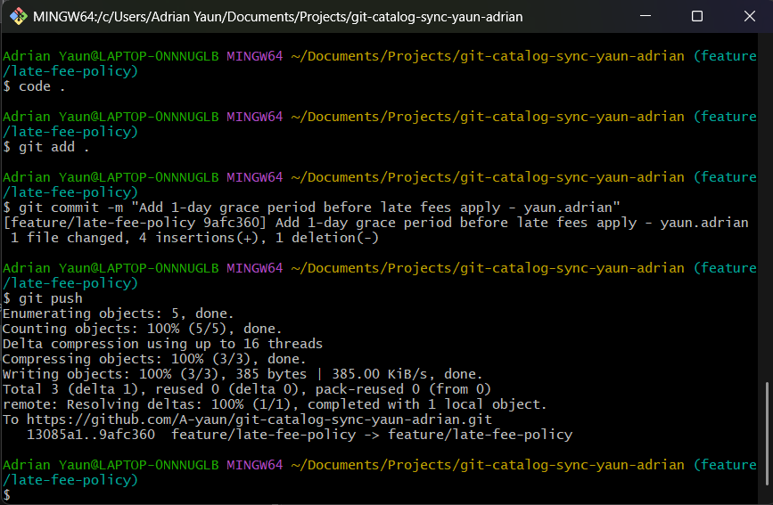
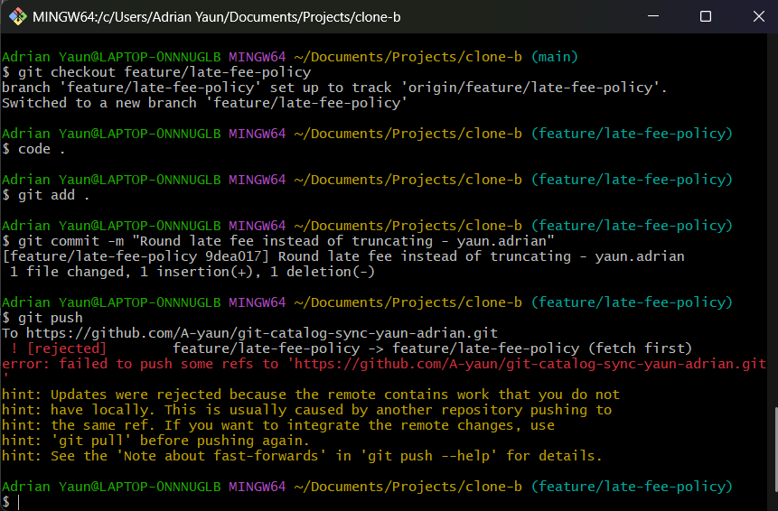
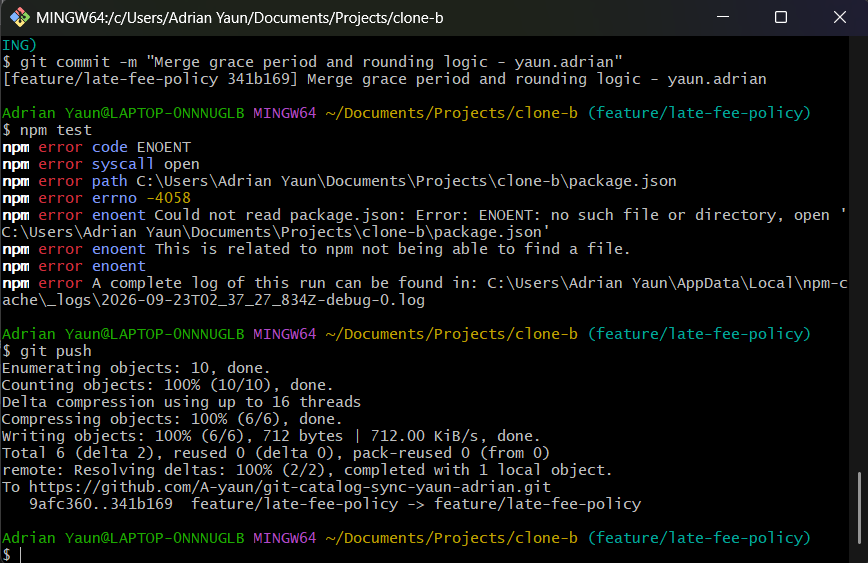
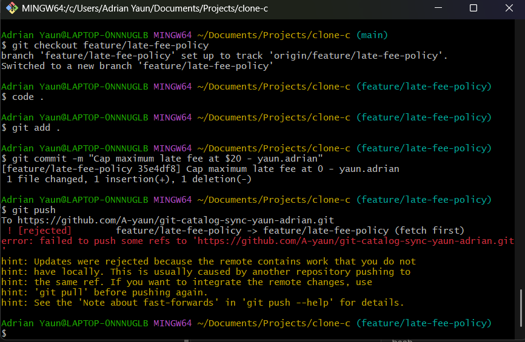
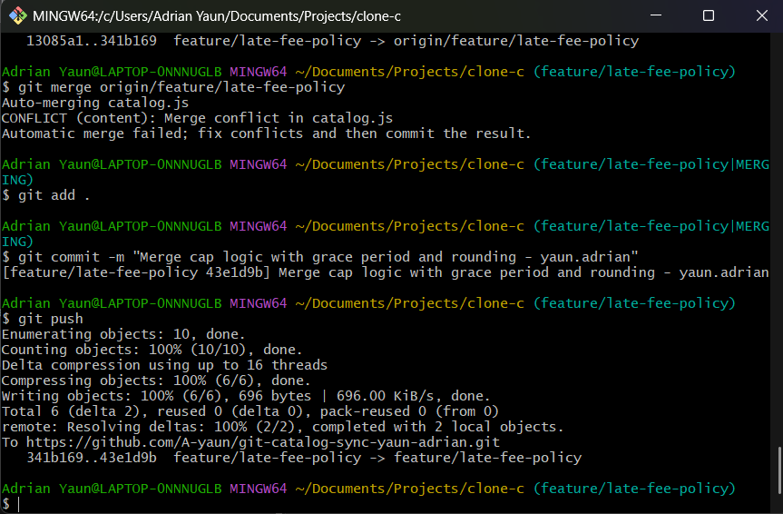
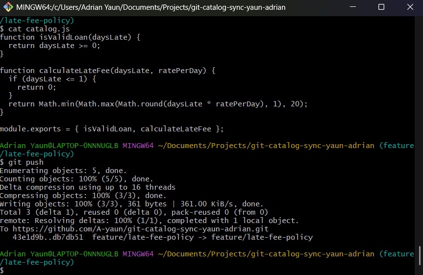
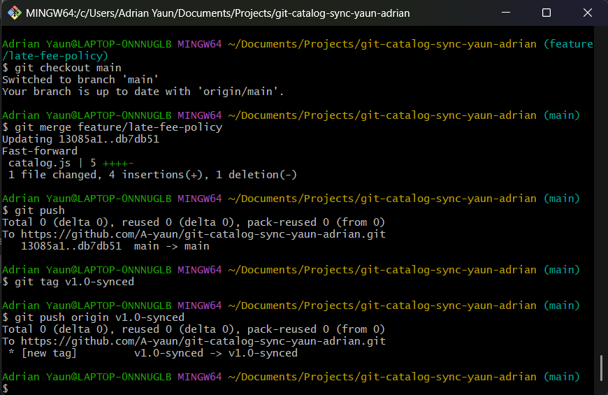

# WORKFLOW.md

## Task Screenshots

### Task 1 — Grace period pushed (Clone A)


### Task 2 — Rejected push (Clone B)


### Task 3 — First merge resolved (Clone B)


### Task 4 — Rejected push (Clone C)


### Task 5 — Three-way merge resolved (Clone C)


### Task 6 — Rebase resolved, no force (Clone A)


### Task 7 — Merged to main, tagged


## Questions

**1. Walk through the final `calculateLateFee` function and name which contributor's change is responsible for each part.**

```js
function calculateLateFee(daysLate, ratePerDay) {
  if (daysLate <= 1) {
    return 0;
  }
  return Math.min(Math.max(Math.round(daysLate * ratePerDay), 1), 20);
}
```

- `if (daysLate <= 1) return 0;` — the grace period, added in Clone A (Task 1).
- `Math.round(daysLate * ratePerDay)` — rounding instead of truncating, added in Clone B (Task 3).
- `Math.max(..., 1)` — the $1 minimum fee, added in Clone A (Task 6).
- `Math.min(..., 20)` — the $20 maximum cap, added in Clone C (Task 5).

**2. Compare Task 3's two-way conflict to Task 5's three-way conflict — what got harder with a third line of work?**

Task 3 was a straightforward either/or: two versions of the same line disagreed (truncate vs. round), and resolving it meant picking a winner or blending two ideas together. Task 5 had three independent changes that all needed to coexist in the same function at once, and the tricky part wasn't just keeping all three — it was getting the order of operations right, since applying the $20 cap before rounding versus after would give different results. More lines of work in conflict meant more interactions to reason about, not just more code to merge.

**3. What's the actual difference between how you resolved Task 5 (merge) and Task 6 (rebase)?**

The Task 5 merge created a new commit with two parents, joining Clone C's history and the remote's history together as they actually happened — an honest record that two people worked in parallel and their work got joined at one point. The Task 6 rebase instead rewrote Clone A's two commits to replay individually on top of everything already on the remote, so each of Clone A's commits could conflict (and get resolved) separately, and the final history is a straight line with no merge commit — as if Clone A had made its changes after everyone else's instead of at the same time.

**4. If this were a real team of three, what one process change would have prevented all three rejected pushes?**

Agreeing that everyone runs `git fetch` (or `git pull`) right before starting new work, and briefly checking in on who's about to touch which function, would have prevented all three rejections. None of them were caused by a git problem — they were caused by working from a stale local copy without checking what had already changed on the remote.